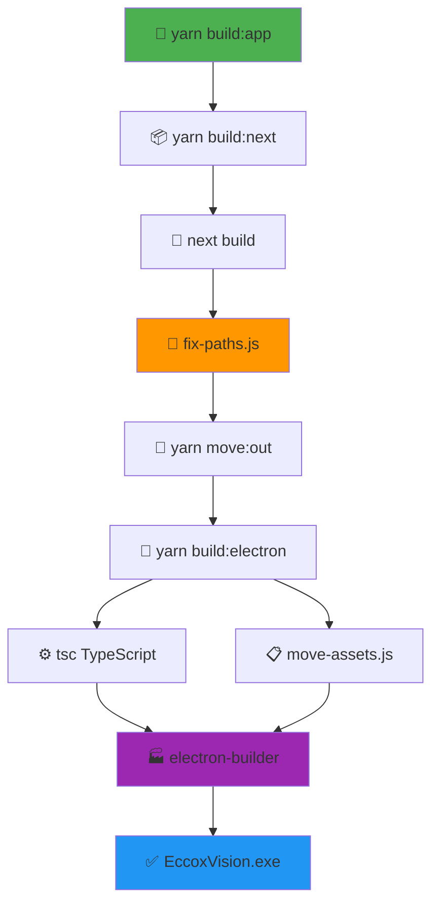

# 🏗️ Guia Visual de Build - EccoxVision

## 📊 Fluxograma do Processo de Build



## 🗂️ Estrutura de Arquivos Durante o Build

### 📁 **Antes do Build**
```
eccox-vision/
├── src/                 # Código fonte Next.js
├── electron/            # Código fonte Electron
│   ├── main.ts         # Processo principal
│   ├── preload.ts      # Script preload
│   └── assets/         # Ícones e recursos
├── next.config.ts      # Configuração Next.js
└── package.json        # Scripts e dependências
```

### 📁 **Durante o Build**
```
eccox-vision/
├── out/                 # ⚠️ Temporário - Build Next.js
│   ├── index.html      # Páginas estáticas
│   ├── _next/          # Assets Next.js
│   └── ...
├── electron/dist/       # 📦 Arquivos processados
│   ├── out/            # Frontend movido
│   ├── assets/         # Recursos copiados  
│   ├── main.js         # TS compilado
│   └── preload.js      # TS compilado
└── dist/               # 🎯 Executáveis finais
```

### 📁 **Após o Build**
```
eccox-vision/
└── dist/                           # 🎯 RESULTADO FINAL
    ├── EccoxVision 1.0.0.exe      # 📱 Portable
    ├── EccoxVision Setup 1.0.0.exe # 💿 Instalador  
    ├── win-unpacked/               # 📂 Descompactado
    └── *.blockmap                  # 🔍 Metadados
```

## 🔧 Scripts Detalhados

### 1️⃣ **yarn build:next**
```bash
# O que faz:
next build              # Compila React/Next.js
node fix-paths.js       # Corrige /_next/ → ./_next/

# Resultado:
out/                    # Pasta com arquivos estáticos
├── index.html         # Página principal
├── _next/             # Assets corrigidos
├── machines/          # Páginas estáticas
└── reports.html       # Página de relatórios
```

### 2️⃣ **yarn move:out** 
```bash
# O que faz:
node move-out.js        # Move out/ → electron/dist/out/

# Resultado:
electron/dist/out/      # Frontend pronto para Electron
├── index.html         
├── _next/             
└── ...
```

### 3️⃣ **yarn build:electron**
```bash
# O que faz:
tsc -p tsconfig.electron.json    # Compila TS → JS
node move-assets.js             # Copia assets/

# Resultado:
electron/dist/
├── main.js           # Processo principal compilado
├── preload.js        # Preload compilado
└── assets/           # Ícones copiados
```

### 4️⃣ **electron-builder**
```bash
# O que faz:
- Empacota electron/dist/ 
- Cria executável Windows
- Gera instalador NSIS
- Assina digitalmente (se configurado)

# Resultado:
dist/
├── EccoxVision 1.0.0.exe      # Portable (~200MB)
├── EccoxVision Setup 1.0.0.exe # Instalador (~200MB)
└── win-unpacked/               # Pasta descompactada
```

## ⚡ Comandos Rápidos

### 🔥 **Build Completo (Recomendado)**
```bash
yarn build:app
```
> ✅ **Um comando para tudo!** Build + Executável em ~5-10 minutos

### 🛠️ **Desenvolvimento**
```bash
yarn dev:electron
```
> 🔄 **Live reload** do frontend + Electron juntos

### 🧪 **Teste Rápido**
```bash
yarn build:next      # Só frontend (~1 min)
yarn dev:electron    # Testar com Electron
```

### 🔍 **Debug**
```bash
# Executar e abrir DevTools
& ".\dist\EccoxVision 1.0.0.exe"

# No console (F12):
ElectronDebug.runFullDiagnostic()
```

## 📋 Checklist de Qualidade

### ✅ **Antes do Build**
- [ ] `yarn install` executado
- [ ] Código commitado no Git
- [ ] Testes locais passando
- [ ] `yarn dev:electron` funcionando

### ✅ **Durante o Build**  
- [ ] `yarn build:next` sem erros
- [ ] Pasta `out/` criada
- [ ] Assets com paths corretos (`./_next/`)
- [ ] `electron/dist/` populado

### ✅ **Após o Build**
- [ ] Pasta `dist/` criada
- [ ] `EccoxVision 1.0.0.exe` existe
- [ ] Executável abre sem erro
- [ ] Interface carrega (não branca)
- [ ] Navegação funciona
- [ ] Database conecta

### ✅ **Validação Funcional**
- [ ] Dashboard mostra dados
- [ ] Criar máquina funciona  
- [ ] Relatórios mostram tabela
- [ ] Rotas dinâmicas funcionam
- [ ] Database manager abre

## 🚨 Solução de Problemas

### 🔴 **Tela Branca**
**Causa:** Assets com path incorreto  
**Solução:** 
```bash
# Verificar se fix-paths.js executou
grep "_next" out/index.html    # Deve mostrar ./_next/
```

### 🔴 **Erro de Compilação TS**
**Causa:** Tipagem incorreta  
**Solução:**
```bash
# Limpar cache e recompilar
rm -rf electron/dist/
yarn build:electron
```

### 🔴 **Executável Não Abre**
**Causa:** Dependências nativas  
**Solução:**
```bash
yarn rebuild
yarn build:app
```

### 🔴 **Dados Não Carregam**
**Causa:** ElectronAPI indisponível  
**Solução:** 
- Verificar `preload.ts` compilado
- Testar `window.electronAPI` no console

## 🎯 Dicas de Performance

### ⚡ **Build Mais Rápido**
```bash
# Build só quando necessário
yarn build:next           # Frontend only (~1 min)
# vs
yarn build:app            # Completo (~5-10 min)
```

### 💾 **Cache Inteligente**
- Next.js cacheia builds incrementais
- Electron-builder reutiliza assets
- Git ignore `out/` e `electron/dist/`

### 🔧 **Desenvolvimento Eficiente**
```bash
# Hot reload para development
yarn dev:electron

# Build production apenas para release
yarn build:app
```

---

## 🎉 Resultado Final

Após seguir este guia, você terá:

- 📱 **EccoxVision 1.0.0.exe** - Aplicação portable funcional
- 💿 **EccoxVision Setup 1.0.0.exe** - Instalador completo
- ✅ **Aplicação 100% operacional** com todas as funcionalidades
- 🚀 **Processo de build documentado** e reproduzível

**Parabéns! Seu fluxo de build está completo e documentado!** 🎊