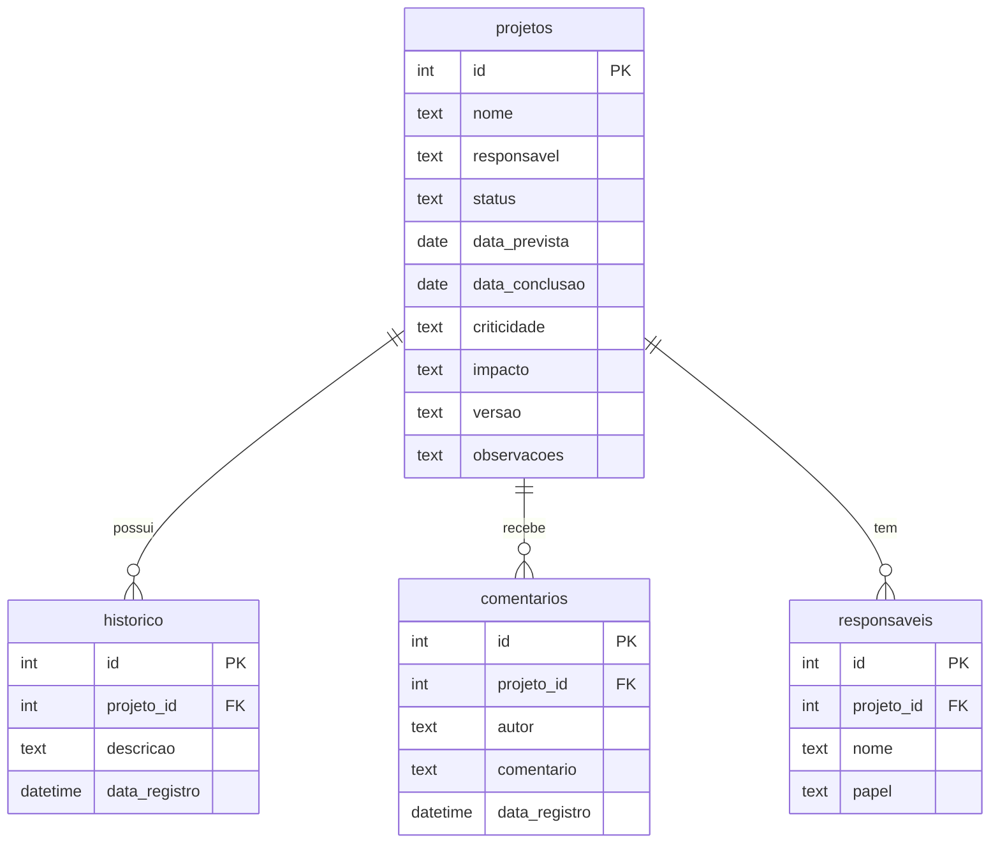

s# 📌 EccoxVision

**Monitoramento e Observabilidade de Serviços e Recursos Mainframe**

Aplicação desktop desenvolvida com **Electron + Next.js + TailwindCSS + TypeScript** para acompanhamento centralizado do status de serviços, softwares e pacotes instalados em máquinas mainframe.

O objetivo é substituir planilhas manuais por uma interface moderna, visual e executiva que permita ao time monitorar pendências, validar entregas e gerar insights para gestores como Maurício, trazendo clareza e padronização ao processo.

---

## 🚀 Funcionalidades

* **Dashboard geral** com visão executiva por máquina/projeto.
* **Status visual** dos itens: obrigatório, não se aplica, concluído, pendente.
* **Controle de datas**: previsão de entrega e conclusão efetiva.
* **Registro de responsáveis** e papéis associados.
* **Histórico de mudanças** para auditoria e rastreabilidade.
* **Comentários locais** para anotações rápidas da equipe.
* **Integração futura** com Project e BI para relatórios gerenciais.

---

## 🛠️ Stack utilizada

* **Next.js** – frontend reativo e moderno.
* **Electron.js** – empacotamento como app desktop.
* **TailwindCSS** – design limpo e responsivo.
* **TypeScript** – tipagem e robustez.
* **Electron-builder** – criação de instaladores.
* **SQLite** – banco de dados local embarcado.

---

## 📜 Scripts NPM

| Script           | Descrição                                                                                 |
| ---------------- | ----------------------------------------------------------------------------------------- |
| `dev`            | Inicia o Next.js em modo de desenvolvimento em `localhost:3000`                           |
| `build:next`     | Compila e exporta os arquivos estáticos do Next.js para a pasta `out/`                    |
| `move:out`       | Copia a pasta `out` para `electron/dist/` para ser incluída na build                      |
| `build:electron` | Compila os arquivos TypeScript do Electron (`main.ts`, `preload.ts`) para `electron/dist` |
| `dev:electron`   | Executa Next.js e Electron juntos com recarregamento automático do frontend               |
| `build:app`      | Compila Next.js + Electron e cria o instalador da aplicação usando `electron-builder`     |

---

## 🔗 Configuração de Build (`electron-builder`)

```json
"build": {
  "appId": "com.eccox.eccoxvision",
  "productName": "EccoxVision",
  "files": [
    "electron/dist/**/*",
    "out/**/*",
    "package.json"
  ],
  "directories": {
    "buildResources": "electron/assets"
  },
  "win": {
    "target": [
      "portable",
      "nsis"
    ],
    "icon": "electron/assets/logo.ico"
  },
  "nsis": {
    "oneClick": false,
    "allowToChangeInstallationDirectory": true,
    "createDesktopShortcut": true,
    "createStartMenuShortcut": true,
    "shortcutName": "EccoxVision"
  }
}
```

---

## 📁 Saída

Após a build, o arquivo `.exe` ou instalador da aplicação estará disponível na pasta raiz `dist/`.

---

## 🚀 Começando o desenvolvimento

```bash
npm install
npm run build:electron
npm run dev:electron
```

---

## 🚀 Para gerar o executável (.exe)

```bash
npm run build:app
```

---

## 🗄 Estrutura do Banco de Dados (SQLite)

```sql
-- Tabela principal de projetos/serviços monitorados
CREATE TABLE projetos (
    id INTEGER PRIMARY KEY AUTOINCREMENT,
    nome TEXT NOT NULL,
    responsavel TEXT,
    status TEXT CHECK(status IN ('Planejado', 'Em Progresso', 'Concluído', 'Futuro')) NOT NULL DEFAULT 'Planejado',
    data_prevista DATE,
    data_conclusao DATE,
    criticidade TEXT CHECK(criticidade IN ('Baixa', 'Média', 'Alta')) DEFAULT 'Média',
    impacto TEXT,
    versao TEXT,
    observacoes TEXT
);

-- Histórico de mudanças
CREATE TABLE historico (
    id INTEGER PRIMARY KEY AUTOINCREMENT,
    projeto_id INTEGER NOT NULL,
    descricao TEXT NOT NULL,
    data_registro DATETIME DEFAULT CURRENT_TIMESTAMP,
    FOREIGN KEY (projeto_id) REFERENCES projetos(id)
);

-- Comentários locais
CREATE TABLE comentarios (
    id INTEGER PRIMARY KEY AUTOINCREMENT,
    projeto_id INTEGER NOT NULL,
    autor TEXT DEFAULT 'Usuário Local',
    comentario TEXT NOT NULL,
    data_registro DATETIME DEFAULT CURRENT_TIMESTAMP,
    FOREIGN KEY (projeto_id) REFERENCES projetos(id)
);

-- Responsáveis adicionais
CREATE TABLE responsaveis (
    id INTEGER PRIMARY KEY AUTOINCREMENT,
    projeto_id INTEGER NOT NULL,
    nome TEXT NOT NULL,
    papel TEXT,
    FOREIGN KEY (projeto_id) REFERENCES projetos(id)
);
```

---

## 🌱 Inserts iniciais de exemplo

```sql
-- Projetos/Serviços
INSERT INTO projetos (nome, responsavel, status, data_prevista, criticidade, impacto, versao, observacoes)
VALUES
('APT Change Alert', 'Equipe Mainframe', 'Em Progresso', '2025-09-30', 'Alta', 'Controle de alterações críticas no sistema', 'v1.0', 'Dependência de homologação'),
('APT Datamover', 'Equipe Storage', 'Planejado', '2025-10-15', 'Média', 'Movimentação de dados entre ambientes', 'v2.1', NULL),
('APT/Bulkload', 'Equipe DB2', 'Futuro', '2025-11-01', 'Alta', 'Carga massiva de dados', 'v1.5', 'Aguardando liberação do DBA'),
('APT/Report', 'Equipe Relatórios', 'Em Progresso', '2025-09-20', 'Média', 'Geração de relatórios executivos', 'v3.2', NULL),
('APT/Batchcopy', 'Equipe Operações', 'Concluído', '2025-08-15', 'Baixa', 'Cópia em lote de pacotes', 'v1.1', 'Finalizado e entregue'),
('APT/Saverestore', 'Equipe Backup', 'Planejado', '2025-09-25', 'Alta', 'Rotinas de backup e restore', 'v2.0', NULL);

-- Responsáveis extras
INSERT INTO responsaveis (projeto_id, nome, papel)
VALUES
(1, 'Maurício', 'Gestor'),
(2, 'Carol', 'Analista'),
(3, 'Diogo', 'Desenvolvedor'),
(4, 'Equipe Relatórios', 'Squad'),
(5, 'Equipe Operações', 'Suporte'),
(6, 'Equipe Backup', 'Infraestrutura');

-- Histórico de mudanças
INSERT INTO historico (projeto_id, descricao)
VALUES
(1, 'Instalação inicial validada'),
(1, 'Aguardando homologação'),
(2, 'Dependência de configuração de storage'),
(3, 'Pacote enviado para aprovação DBA'),
(5, 'Entrega confirmada em 15/08/2025');

-- Comentários locais
INSERT INTO comentarios (projeto_id, autor, comentario)
VALUES
(1, 'Carol', 'Maurício pediu foco para concluir até o fim do ano'),
(3, 'Diogo', 'Será integrado ao BI após estabilização'),
(6, 'Usuário Local', 'Testar restore em ambiente de homologação antes de liberar em produção');
```

---

## 📊 Diagrama ER Simplificado

